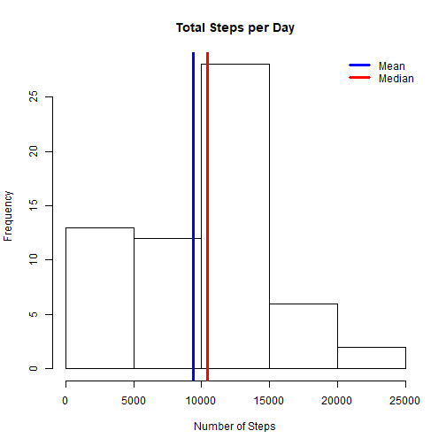
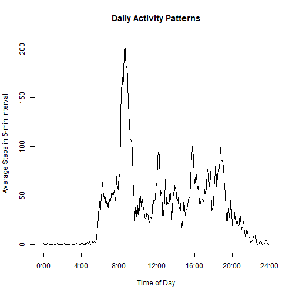
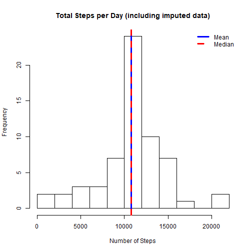
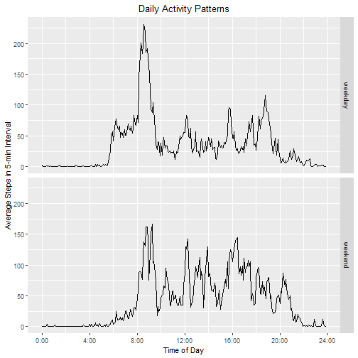

# Reproducible Research Project 1


Load, process data (assumes .csv file is in working directory):

```r
library(dplyr)
library(ggplot2)

activity<-read.csv("activity.csv", colClasses = c("integer", "Date", "integer"))

activity$interval<-60*floor((activity$interval+1)/100)+(activity$interval%%100)
```
## **What is the mean total number of steps taken per day?**


```r
dailySteps<-summarize(group_by(activity, date), steps=sum(steps, na.rm=TRUE))

meanSteps<- mean(dailySteps$steps)
medianSteps<-median(dailySteps$steps)

hist(dailySteps$steps, xlab="Number of Steps", main="Total Steps per Day")
abline(v=mean(dailySteps$steps), col="blue", lwd=3)
abline(v=medianSteps, col="red", lwd=3)
legend(x="topright", legend=c("Mean", "Median"), col=c("blue", "red"), bty='n', lwd=3)
```



The mean number of steps is: ``9354``.

The median number of steps is: ``10395``.

## **What is the average daily activity pattern?**


```r
daily_activity<-summarize(group_by(activity, interval), avg_steps=mean(steps, na.rm=TRUE))
daily_activity$hours<-daily_activity$interval/60

plot(daily_activity$hours, daily_activity$avg_steps, type='l', axes=FALSE,
     xlab="Time of Day", ylab="Average Steps in 5-min Interval", main="Daily Activity Patterns")
axis(2)
axis(1, at=0:6*4, labels=paste(0:6*4, ":00", sep=""))
```



```r
max_interval_num <- which(daily_activity$avg_steps==max(daily_activity$avg_steps))
max_interval_int<-activity$interval[max_interval_num]
step_interval<-sprintf("%02d:%02d", floor(max_interval_int/60), max_interval_int%%60)
```

The five-minute interval containing the average maximum number of steps begins at: ``08:35``.

## **Imputing missing values**


```r
missingVals <- sum(is.na(activity$steps))

#use average number of steps for the corresponding 5-min interval to impute
steps_imputed<-transform(activity, steps=ifelse(is.na(steps), daily_activity$avg_steps, steps))

dailyImputed <- summarize(group_by(steps_imputed, date), steps=sum(steps))
```

There are ``2304`` missing values in the dataset.


```r
meanImputed<-mean(dailyImputed$steps)
medianImputed<-median(dailyImputed$steps)

hist(dailyImputed$steps, xlab="Number of Steps", breaks=11, main="Total Steps per Day (including imputed data)")
abline(v=meanImputed, col="blue", lwd=3)
abline(v=medianImputed, col="red", lwd=3, lty=2)
legend(x="topright", legend=c("Mean", "Median"), col=c("blue", "red"), bty='n', lwd=3, lty=c(1, 2))
```



Using imputed data:
The **mean** number of steps taken is: ``10766``.

The **median** number of steps taken is: ``10766``.

The **total** number of steps has increased from ``570608`` to ``656738``.

## **Are there differences in activity patterns between weekdays and weekends?**


```r
weekend<-factor(weekdays(steps_imputed$date) %in% c("Saturday", "Sunday"), labels=c("weekday", "weekend"))

imputeSteps<-aggregate(steps_imputed$steps, by=list(interval=steps_imputed$interval, weekday=weekend), mean)

ggplot(imputeSteps, aes(interval/60, x)) + geom_line() + facet_grid(weekday ~ .) +
  scale_x_continuous(breaks=0:6*4, labels = paste(0:6*4, ":00", sep="")) +
  labs(y="Average Steps in 5-min Interval", x="Time of Day") + ggtitle("Daily Activity Patterns") +
  theme(plot.title = element_text(hjust=0.5))
```


